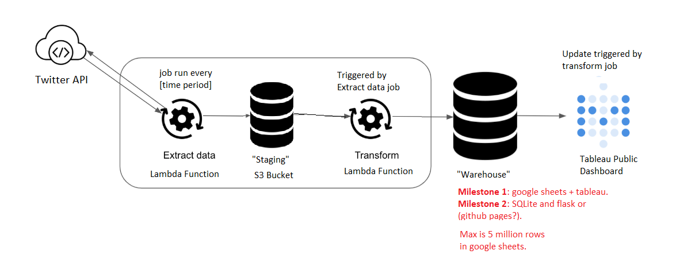

# Canadian MP Tweet Data Pipeline & Analysis

**Problem:** What is happening with the Canadian political conversation on twitter?

This project will collect the tweets of Canadian MPs and aggregate them into a useful dashboard to help people quickly understand the important issues and who is focusing on what within the current policial conversation.

### Architecture Diagram

***NOTE: A staging S3 bucket is used to demonstrate that I know how to do this (ETL), it’s not necessarily the optimal way. Modern data warehouses like Snowflake provide functionality to load semi-structured data directly into the warehouse where you can then perform transformations (ELT vs ETL) to produce tables ready for the end user.***

### Next Steps + Enhancements

1. Scheduling with Airflow to make backfilling easier.
2. Chuck each pull into seperate parts to enable concurrency.
3. Create a AWS infrastructure teardown script.

### References

The list of Canadian MP Twitter accounts - created by the House of Commons:
https://twitter.com/i/lists/864088912087715840
